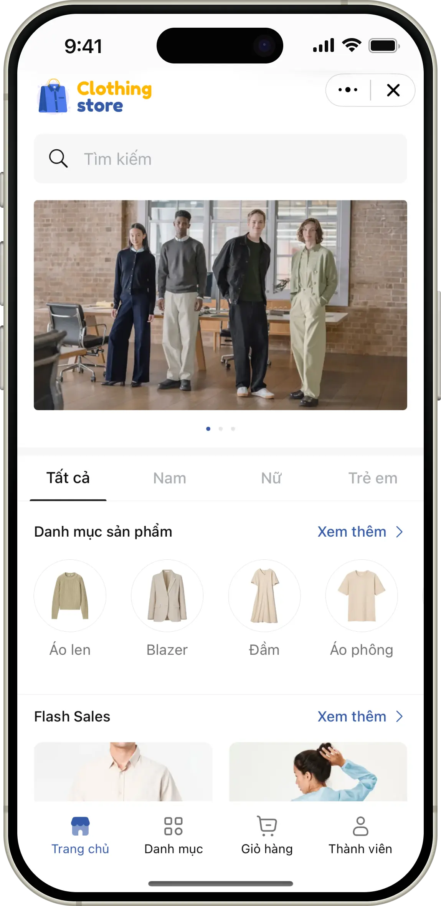
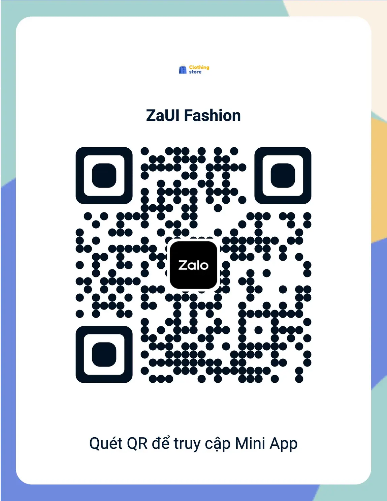
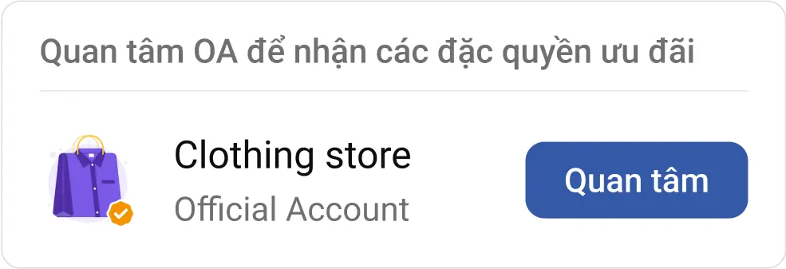
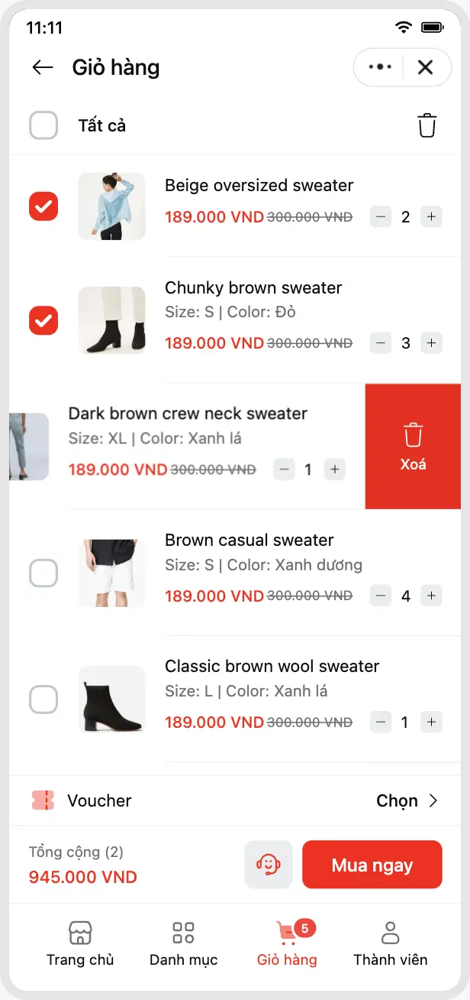
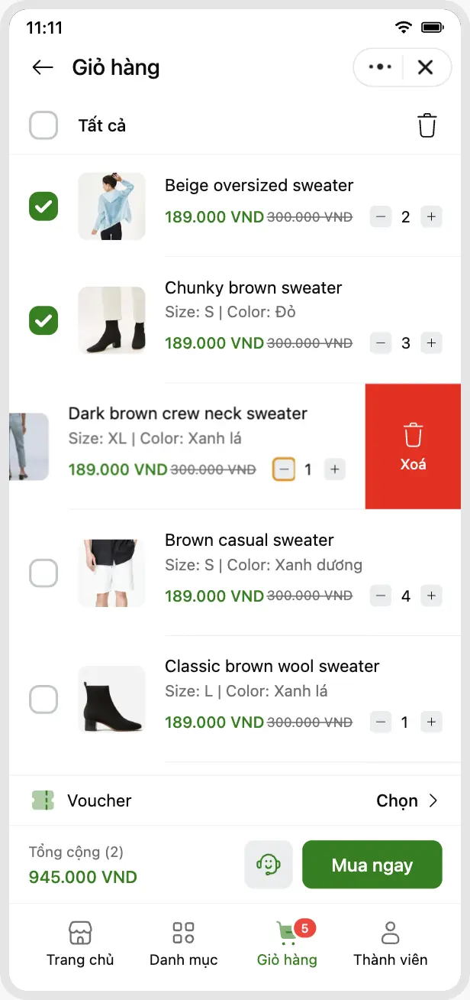

# ZaUI Fashion

<p style="display: flex; flex-wrap: wrap; gap: 4px">
  
  
  
  
  
  
</p>

A template for online sales applications. It provides full features such as product viewing, shopping cart, payment, etc. Can be used for various industries.

|                      Demo                       |                  Entrypoint                  |
| :---------------------------------------------: | :------------------------------------------: |
|  |  |

## Setup

### Using Zalo Mini App Extension

1. Install [Visual Studio Code](https://code.visualstudio.com/download) and [Zalo Mini App Extension](https://mini.zalo.me/docs/dev-tools).
1. Click on **Create Project** > Choose **ZaUI Fashion** template > Wait until the generated project is ready.
1. **Configure App ID** and **Install Dependencies**, then navigate to the **Run** panel > **Start** to develop your Mini App 🚀

### Using Zalo Mini App CLI

> **Note:** Vite 5 compatibility in CLI is under development. Until then, please use the Zalo Mini App Extension.

1. [Install Node JS](https://nodejs.org/en/download/).
1. [Install Zalo Mini App CLI](https://mini.zalo.me/docs/dev-tools/cli/intro/).
1. **Download** or **clone** this repository.
1. **Install dependencies**:
   ```bash
   npm install
   ```
1. **Start** the dev server using `zmp-cli`:
   ```bash
   zmp start
   ```
1. **Open** `localhost:3000` in your browser and start coding 🔥

### Using Zalo Mini App Studio

This template is built using **Vite 5.x**, which is **not compatible** with Zalo Mini App Studio.

## Deployment

1. **Create** a Zalo Mini App ID. For instructions, please refer to the [Coffee Shop Tutorial](https://mini.zalo.me/tutorial/coffee-shop/step-1/).

1. **Deploy** your mini program to Zalo using the ID created.

   If you’re using Zalo Mini App Extension: navigate to the Deploy panel > Login > Deploy.

   If you’re using `zmp-cli`:

   ```bash
   zmp login
   zmp deploy
   ```

1. Scan the **QR code** using Zalo to preview your mini program.

## Usage:

The repository contains sample UI components for building your application. You may [integrate your APIs](#load-data-from-your-server) to load categories, products, and process orders. You may also modify the code to suit your business needs.

Folder structure:

- **`src`**: Contains all the logic source code of your Mini App. Inside the `src` folder:

  - **`components`**: Reusable components written in React.js.
  - **`css`**: Stylesheets; pre-processors are also supported.
  - **`mock`**: Example data as json files.
  - **`pages`**: A Page is a React component registered in the router that represents a full view. Smaller sections within the page can be components for better maintainability, though they don’t necessarily need to be reusable.
  - **`static`**: Static assets to be deployed along with your Mini App. Notice: large static assets should be served from a CDN.
  - **`utils`**: Reusable utility functions, such as API integration, client-side cart management, formatting, etc.
  - **`app.tsx`**: Root component of your entire Mini App. React DOM will mount this component to the element `#app`.
  - **`global.d.ts`**: Contains TypeScript declarations for third-party modules and global objects.
  - **`hooks.ts`**: Custom utility hooks.
  - **`router.ts`**: Router configuration. New pages should be registered here.
  - **`state.ts`**: Global state management. Jotai is used for simplicity and performance.
  - **`types.d.ts`**: TypeScript declarations for business related objects.

- **`app-config.json`**: [Zalo Mini App Configuration](https://mini.zalo.me/documents/intro/getting-started/app-config/).

The other files (such as `tailwind.config.js`, `vite.config.mts`, `tsconfig.json`, `postcss.config.js`, `.eslintrc.js`, and `.prettierrc`) are configurations for libraries used in your application. Visit the library's documentation to learn how to use them.

## Recipes

### Load data from your server

1. In `app-config.json`, set `template.apiUrl` to your API URL.
   ```json
   "template": {
      "apiUrl": "https://my-server.com/api/", // Set this to your API URL
   }
   ```
1. Your server should implement the following APIs:
   - `GET  /categories`: Retrieve a list of categories.
   - `GET  /products`: Retrieve a list of products.
   - `GET  /banners`: Retrieve a list of banner images to display on the home page.

> Refer to the `src/mock/*.json` files for sample data and structure.

> You may wish to add more APIs to support your business needs. For authorization required APIs, the user's identity can be retrieved from the `Authorization: Bearer ${ACCESS_TOKEN}` header sent along with each API request. Visit the [Login with Zalo](https://mini.zalo.me/intro/authen-user/) documentation for more detailed instructions.

### Link Official Account

The template contains 2 OA-related features:

| Feature             | Demo                                        | Configuration                                                                                                                                                                                                                                                               |
| ------------------- | ------------------------------------------- | --------------------------------------------------------------------------------------------------------------------------------------------------------------------------------------------------------------------------------------------------------------------------- |
| Chat with OA button |  | In `app-config.json`, set `template.oaIDtoOpenChat` to your OA ID.                                                                                                                                                                                                          |
| Follow OA widget    |    | Follow the instructions to [authenticate your Mini App via Zalo OA](https://mini.zalo.me/documents/pages/thong-bao-huong-dan-xac-thuc-mini-app/). For more information, please refer to the [showOAWidget](https://mini.zalo.me/documents/api/showOAWidget/) documentation. |

### Customize theme

Adjust CSS variables in `src/css/tailwind.scss` as needed to fit your desired branding.

| `--primary: red;`                     | `--primary: #008000;`                     |
| ------------------------------------- | ----------------------------------------- |
|  |  |
